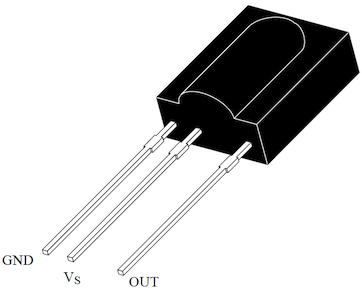
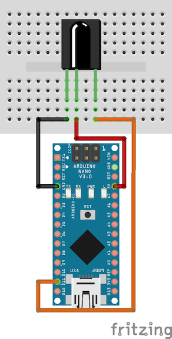
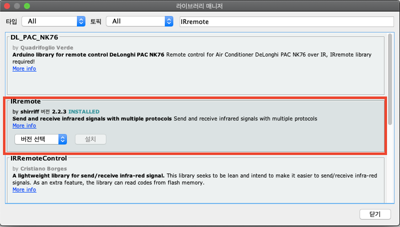
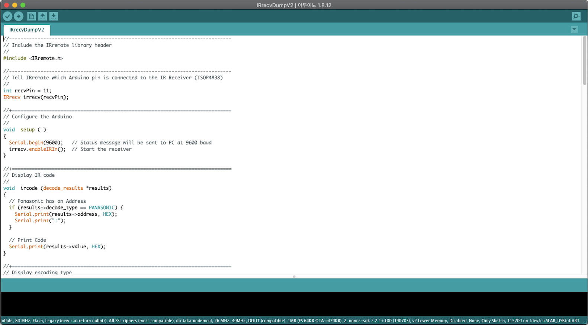

# 음성으로

# 음성으로 TV를 제어해 보자!

여가 생활을 즐기기 위해 TV를 보려 하면 리모컨이 저 멀리 있거나, 어디 있는지 모를 때가 많다. 그럴 때마다 한번 쯤은 리모컨 없이 기계를 제어하는 상상을 해 보았을 것이다. 물론 현재 시중에는 더욱 쉽고 다양한 방법으로 제어 할 수 있도록 개발된 제품이 많이 출시되어 있지만 이를 위해 새 TV를 사거나 AI 스피커를 구매하는 것은 비효율 적이라는 생각이 들었다. 그래서 간단하게나마 직접 개발해 보기로 하였다.

가장 처음 해야 할 일은 TV에 자동으로 신호를 전송하는 부분을 설계하는 일이다. 리모컨에 직접 모터와 각종 장치들을 달아 제어하는 방법도 있지만, 이 방식은 많은 문제가 존재하므로 적외선 수신기로 리모컨의 적외선 신호를 그대로 복제하여 저장해 두었다가 신호를 보내고 싶을 때 발신기로 적외선 신호를 전송하는 방식을 사용하기로 하였다. 쉽게 말해, 리모컨을 복제해 두었다가 특정 음성이 인식되면 신호를 직접 생성해서 전송하는 장치를 만든다는 것이다.

## Hardware
그러기 위해서는 먼저 리모컨의 신호를 복제해 두어야 하는데, 간단히 아두이노 나노와 적외선 수신 센서를 이용해 리모컨의 적외선 신호를 복제해 보겠다. 필자가 사용한 적외선 센서는 TSOP1738이고, 이 센서의 PINOUT은 아래의 이미지와 같다.

 <br/>
TSOP1738이 동작하기 위해서는 5V의 전압이 필요하다. 그러므로 아두이노의 5V핀과 TSOP의 Vs부분을 연결 시켜주도록 하자. 또한, 아두이노에서 TSOP의 데이터를 읽어오기 위해 OUT핀과 아두이노의 D11핀도 연결한다. (굳이 D11핀에 연결하는 이유는 아래에 나온다) 아래의 이미지처럼 회로를 구성하면 된다.

 <br/>
***

## Software
하드웨어의 구성이 끝났으므로 소프트웨어를 만들어 보겠다. IRremote 라이브러리에 포함된 예제인 IRrecvDumpV2를 이용하도록 하겠다. IRremote 라이브러리는 아두이노에 기본적으로 포함되어있는 라이브러리가 아니므로 먼저 IRremote 라이브러리를 추가해야 한다.

아두이노 IDE의 스케치->라이브러리 포함하기->라이브러리 관리로 들어가면 라이브러리 매니저 창이 뜰것이다. IRremote를 검색하여 설치 해 주도록 하자.

 <br/>

라이브러리 설치를 완료했으면 아두이노 IDE의 **파일->예제->IRremote->IRrecvDumpV2**를 열어준다. 아래와 같은 코드가 로딩된다면 잘 설치된 것이다.



위에서 Data핀을 아두이노의 D11핀에 연결하라고 하였다. 그 이유가 여기에 있는데, 코드의 9번째 줄을 보면

```cpp
int recvPin = 11;
```

와 같이 초기화 된 것을 알 수 있다. 이는 데이터를 받을 핀을 지정해 준 것인데, 간단히 데이터를 확인만 할 것이므로 코드를 수정할 필요가 없게 하기위해 D11핀에 연결한 것이다. D11핀이 아닌 다른 핀으로 변경해 주어도 문제는 없다.

회로 구성과 코드 편집이 완료 되었다면 아두이노를 컴퓨터에 연결하여 프로그램을 컴파일/업로드 한다.

업로드가 성공적으로 완료되었다면 **툴->시리얼 모니터**를 실행하고 적외선 센서를 향해 리모컨 버튼을 눌러 신호를 읽어본다. 필자는 SK BTV를 사용하므로 아래와 같은 신호를 얻을 수 있었다.

|<div style="text-align: center;">기능</div>|<div style="text-align: center;">신호</div>|
|---|---|
|<div style="text-align: center;">전원</div>|<div style="text-align: center;">1FE807F 1FEFF00 E0E040BF 20DF10EF 1FE8F80</div>|
|<div style="text-align: center;">볼륨up</div>|<div style="text-align: center;">E0E0E01F 20DF40BF</div>|
|<div style="text-align: center;">볼륨down</div>|<div style="text-align: center;">E0E0D02F 20DFC03F</div>|
|<div style="text-align: center;">채널up</div>|<div style="text-align: center;">1FE02FD FFFFFFFF 1FEFF00</div>|
|<div style="text-align: center;">채널down</div>|<div style="text-align: center;">1FE827D FFFFFFFF 1FEFF00</div>|
|<div style="text-align: center;">숫자 0</div>|<div style="text-align: center;">1FE04FB FFFFFFFF 1FEFF00</div>|
|<div style="text-align: center;">숫자 1</div>|<div style="text-align: center;">1FE847B FFFFFFFF 1FEFF00</div>|
|<div style="text-align: center;">숫자 2</div>|<div style="text-align: center;">1FE44BB FFFFFFFF 1FEFF00</div>|
|<div style="text-align: center;">숫자 3</div>|<div style="text-align: center;">1FEC43B FFFFFFFF 1FEFF00</div>|
|<div style="text-align: center;">숫자 4</div>|<div style="text-align: center;">1FE24DB FFFFFFFF 1FEFF00</div>|
|<div style="text-align: center;">숫자 5</div>|<div style="text-align: center;">1FEA45B FFFFFFFF 1FEFF00</div>|
|<div style="text-align: center;">숫자 6</div>|<div style="text-align: center;">1FE649B FFFFFFFF 1FEFF00</div>|
|<div style="text-align: center;">숫자 7</div>|<div style="text-align: center;">1FEE41B FFFFFFFF 1FEFF00</div>|
|<div style="text-align: center;">숫자 8</div>|<div style="text-align: center;">1FE14EB FFFFFFFF 1FEFF00</div>|
|<div style="text-align: center;">숫자 9</div>|<div style="text-align: center;">1FE946B FFFFFFFF 1FEFF00</div>|

신호를 얻을 때 주의할 점이 있는데 대상 리모컨의 적외선이 아닌 태양 적외선, 다른 장치의 적외선 등 잡음이 섞일 수 있으니 여러번 측정하여 가장 최적화 된 값을 읽어야 한다는 점이다. 필자는 5번 정도 측정해 보았다.

또한, 실제로 읽히는 신호는 필자의 리모컨 신호와는 다를 수도 있다. TV의 종류와 리모컨의 종류에 따라 신호 형식이 달라질 수 있으므로 자신의 리모컨에 맞는 신호를 얻어야 한다.

다음 글에서는 얻은 신호를 이용해 실제로 리모컨 없이 TV를 제어하는 방법에 대해 글을 쓰도록 하겠다. 얻은 신호는 한 곳에 잘 저장해 두도록 하자.
